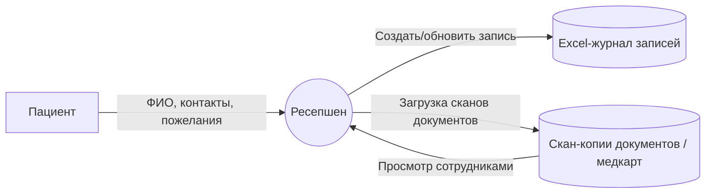
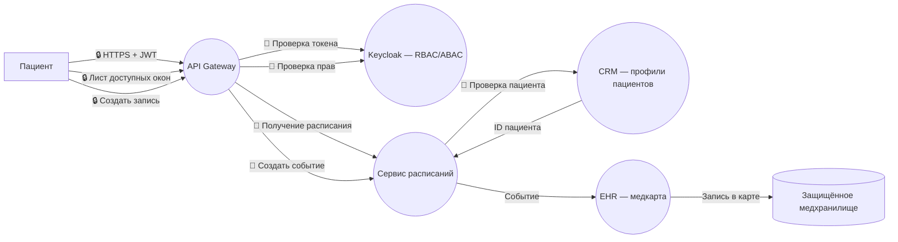
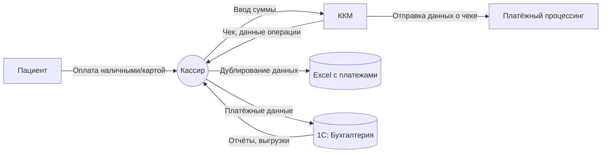
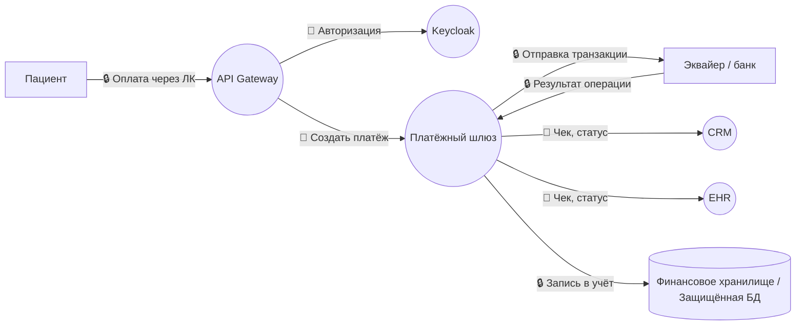
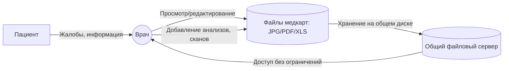
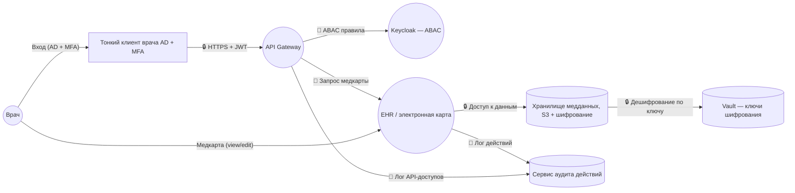

# Выявление конфиденциальных данных

## 1.1. Данные пациентов (PII + медицинские)

**Уже присутствуют, но хранятся небезопасно:**

* ФИО
* Дата рождения
* Телефон
* Email
* Паспортные данные (на контракте)
* Адрес прописки
* Место работы/учёбы
* Контакты ближайших родственников

**Медицинские данные (особая категория по ФЗ-152 / ФЗ-323):**

* Медицинская карта
* Диагнозы
* История обращений
* Назначения и заключения врачей
* Результаты анализов
* Направления
* Медицинские изображения (сканы, JPG/PNG)

**Неучтённые данные:**

* Записи разговоров (если есть телефонные звонки)
* Логи посещения офиса
* История взаимодействия в мессенджерах или email
* Данные из мобильного приложения (в будущем)

## 1.2. Финансовые данные

Хранятся частично в Excel:

* История платежей
* Счета
* Возвраты
* Оплаты по ДМС / страховым полисам
* Реквизиты пациентов
* Данные взаимодействия ККМ ↔ 1С

## 1.3. Данные сотрудников

* ФИО
* Паспортные данные
* Медкнижки
* Должность
* Зарплаты
* Личные контакты
* Логины AD

## 1.4. Данные склада (ТМЦ)

* Регистры учёта
* Накладные
* Данные поставщиков
* Инвойсы и договоры
* Отчёты по движению материалов

## 1.5. Технические данные

* Логи серверов
* Логи 1С
* Логи действий пользователей (отсутствуют!)
* Доступы (AD, LDAP, почта)

## Запись пациента на приём (as-is)

### Участники

* Пациент
* Ресепшен
* Excel-журнал
* Медицинская карта (скан / Excel)

### Потоки данных

1. Пациент сообщает свои данные устно → сотруднику
2. Сотрудник заносит их в Excel (журнал)
3. Создаёт/обновляет файл с картой (JPG/PDF/Excel)
4. Копии файлов хранятся на общем диске без разграничения прав

### Проблемы

* Нет RBAC/ABAC
* Нет шифрования
* Нет аудит-логов
* Файлы доступны всем сотрудникам, включая склад/кассу

## Запись пациента на приём (to-be)

* API Gateway маршрутизирует запросы по сервисам
* RBAC фильтрует операции в бизнес-логике
* Внутренние сервисы отделены сегментацией
* Шифрование данных между сервисами
* Централизованные логи

## Приём платежей (As-is)

### Участники

* Пациент
* Кассир
* Excel
* 1С Бухгалтерия
* ККМ

### Потоки данных

1. Кассир вносит данные в Excel
2. Дублирует ввод в 1С
3. ККМ отправляет чек → сервер 1С
4. Отчётность хранится локально

### Проблемы

* Дублирование (нарушение Data Minimization)
* Нет шифрования канала ККМ ↔ 1С (OLE)
* Нет защиты Excel
* Можно подменить суммы

## Приём платежей (to-be)

* API Gateway + Auth сервис
* RBAC на уровне отдельных бизнес-функций
* Сегментация internal flows
* Шифрование данных в покое
* Мониторинг событий безопасности

## Работа врача с медкартой (As-is)

### Участники

* Врач
* Файл медкарты (XLS/JPG/PDF)
* File Server
* AD

### Потоки

1. Врач открывает файл на общем диске
2. Дополняет/заменяет скан
3. Файл без контроля версий

### Проблемы

* Полный доступ окружения к медицинским картам
* Нет шифрования "data at rest"
* Нет журнального аудита

## Работа врача с медкартой (to-be)

* Углублённое разделение сервисов
* Валидация данных по Zero-Trust принципам
* Прозрачность и аудит операций
* Шифрование на уровне payload
* Ограничения межсервисных вызовов