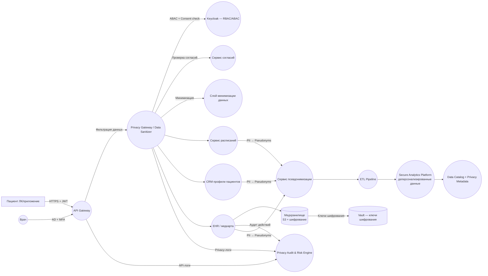

# Privacy by Design

Для состояния **As-Is → To-Be** необходимо предусмотреть следующие направления защиты данных *ещё на этапе проектирования*:

1. Минимизация собираемых данных
2. Разделение идентификаторов и данных
3. Контроль доступа по контексту (ABAC)
4. Шифрование везде, где это возможно
5. Аудит действий и отслеживание аномалий
6. Псевдонимизация / деперсонализация данных в аналитике
7. Принцип “need-to-know” в хранилищах и интеграциях
8. Privacy-by-default настройки
9. Мониторинг рисков и инцидентов

## Новые блоки, которые следует добавить в архитектуру (To-Be)

Ниже — перечень компонент, которых **нет в As-Is**, но которые должны появиться в целевой архитектуре для реализации PbD.

## Privacy Gateway / Data Sanitizer

**Функции:**

* фильтрация входящих/исходящих данных
* маскирование атрибутов
* проверка минимальности данных
* вычищение PII из запросов/ответов перед передачей в аналитические сервисы

**Почему нужно:**
в As-Is сервисы могут передавать лишние данные → риск утечки минимизируется на уровне шлюза.

## Pseudonymization Service

**Функции:**

* замена прямых идентификаторов (ID пациента, телефон, полис) на псевдонимы
* поддержка обратимой/необратимой деперсонализации
* управление ключами псевдонимизации (не путать с шифрованием)

**Почему нужно:**
в As-Is аналитика работает на исходных данных → нарушение PbD.

## Consent & Data Processing Policy Service

**Функции:**

* хранение согласий на обработку данных
* проверка: “имеем ли мы право использовать эти данные для этой операции?”
* аудит изменения согласий
* API для получения статуса согласия

**Почему нужно:**
ни в As-Is, ни в To-Be этого слоя нет → нарушение принципов GDPR и PbD.

## Data Minimization Layer (DML)

**Функции:**

* автоматическое исключение лишних атрибутов из запросов к сервисам
* правила минимальности, определённые владельцами данных
* централизованное хранилище политик минимизации

## Privacy Audit & Risk Engine

**Функции:**

* анализ логов, выявление аномалий
* определение операций, ведущих к рискам
* контроль попыток массового доступа к данным
* алерты при нарушении политик

## Secure Analytics Platform (деперсонализированный слой аналитики)

**Функции:**

* приём только псевдонимизированных / агрегированных данных
* невозможность восстановления личности пациента
* слой Data Mart для аналитики без PII
* механизмы дифференциальной приватности при выгрузке данных

**Почему нужно:**
в As-Is аналитика строится на исходных медицинских данных → высокий риск нарушения конфиденциальности.

## Data Catalog + Privacy Metadata Layer

**Функции:**

* классификация данных: PII / SPII / Non-PII
* хранение метаданных о политике приватности
* управление жизненным циклом данных (retention)

## Что изменится в To-Be (новая архитектура)?

* Данные пациента **не будут попадать в аналитику в исходном виде**
* Все сервисы будут получать **только те данные, которые им реально нужны**
* Все запросы будут проходить через **Privacy Gateway**
* Логирование будет идти через **Privacy Audit Engine**
* Реализуется **контроль согласий и политик обработки**

## Схема архитектуры C4

